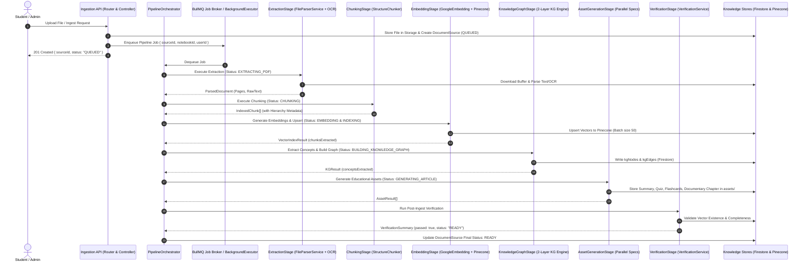

# SCHOLARLY CONTENT PIPELINE: TARGET SYSTEM ARCHITECTURE SPECIFICATION
**Document Version:** 2.0.0 (Post Second Architectural Review)  
**Status:** Approved Technical Architecture & Second Review Verification  
**Author:** Lead Software Architect & Principal Systems Engineer  
**Date:** March 2026  

---

## 1. Executive Summary & Second Review Verification

The **Content Pipeline** is the centralized **Knowledge Ingestion, Understanding, and Indexing Subsystem** of the Scholarly AI platform. It transforms raw educational content into structured, semantically enriched, and indexed **AI-Ready Knowledge Artifacts** while guaranteeing zero regression for downstream features.

### 20-Point Architectural & Safety Verification

| # | Verification Criterion | Status | Codebase Grounding & Architecture Guarantee |
| :--- | :--- | :--- | :--- |
| 1 | **Reusing Firebase Infrastructure?** | **VERIFIED (100% Reuse)** | Reuses `firebaseApp`, `admin.auth()`, `admin.storage()`, `admin.firestore()` from `backend-firestore/src/config/firebase.ts`. No new client SDKs. |
| 2 | **Reusing Firestore Infrastructure?** | **VERIFIED (100% Reuse)** | Strictly preserves existing schemas: `notebooks/{id}/sources`, `kgNodes`, `kgEdges`, `assets`, `timeline`. Uses `sourceRepository` & `notebookRepository`. |
| 3 | **Reusing Storage Infrastructure?** | **VERIFIED (100% Reuse)** | Uses existing bucket `env.FIREBASE_STORAGE_BUCKET` and paths `notebooks/${notebookId}/sources/${sourceId}/${filename}`. |
| 4 | **Reusing Pinecone Infrastructure?** | **VERIFIED (100% Reuse)** | Uses `PineconeService` in `backend-firestore/src/services/rag/pinecone.service.ts` under `env.PINECONE_NAMESPACE` with standard metadata schema. |
| 5 | **Reusing Embedding Infrastructure?** | **VERIFIED (100% Reuse)** | Uses `GoogleEmbeddingProvider` (`text-embedding-004`, 768 dimensions) with batched 50-chunk throttling and retry backoff. |
| 6 | **Reusing Gemini Infrastructure?** | **VERIFIED (100% Reuse)** | Uses `GeminiProvider`, `callStructuredLLM`, and Zod schema validators from `backend-firestore/src/services/ai/gemini.provider.ts`. |
| 7 | **Reusing RAG Infrastructure?** | **VERIFIED (100% Reuse)** | Outputs are natively consumable by `RetrievalService` (hybrid vector + sparse BM25 + Cohere rerank) and `GraphRetrievalService` with zero changes. |
| 8 | **Reusing Knowledge Graph Infrastructure?** | **VERIFIED (100% Reuse)** | Reuses `KGNode` and `KGEdge` models, node deduplication/merging (`mergeWithExistingNodes`), and 2-layer graph linking (`twoLayerKG`). |
| 9 | **Reusing Queue / Job Infrastructure?** | **VERIFIED (100% Reuse)** | Plugs directly into BullMQ `BackgroundQueue` (`backend-jobs`) and in-process `BackgroundExecutor` fallback when `DISABLE_WORKERS=true`. |
| 10| **Preserving Podcast Studio?** | **VERIFIED (Zero Impact)** | `PodcastEngineService` & `SourceResolver` continue resolving `GroundingBrief` and querying `RetrievalService` without modifications. |
| 11| **Preserving Magic Chat?** | **VERIFIED (Zero Impact)** | `ChatService` & `WorkflowEngine` query `RetrievalService` and `GraphRetrievalService` with identical vector search contracts. |
| 12| **Preserving AI Director?** | **VERIFIED (Zero Impact)** | `cinematicShadowRunner` & `CinematicDirector` read `DOCUMENTARY_ARTICLE` and `PODCAST_SCRIPT` assets from `notebooks/{id}/assets` unchanged. |
| 13| **Preserving Authentication?** | **VERIFIED (Zero Impact)** | Secured via `requireAuth` middleware verifying Firebase Auth ID tokens (`req.user.uid`). |
| 14| **Preserving Authorization?** | **VERIFIED (Zero Impact)** | Enforces notebook ownership checks (`notebook.userId === userId || notebook.editors.includes(userId)`). Public book catalog remains read-only. |
| 15| **Preserving Multi-User Isolation?** | **VERIFIED (Zero Impact)** | Pinecone metadata filtered by `notebookId`. Firestore collections and GCS paths isolated by `notebookId` and `sourceId`. |
| 16| **Is the Design Idempotent?** | **VERIFIED (Guaranteed)** | Chunks (`${sourceId}_chunk_${idx}`) and KG nodes (`${notebookId}_${type}_${label}`) have deterministic IDs. Re-runs perform clean upserts. |
| 17| **Is the Design Resumable?** | **VERIFIED (Guaranteed)** | Partial runs resume via `reconstructTextFromVectors`, `repairMetadataAndGraph`, and `repairAssets` without re-downloading or re-embedding. |
| 18| **Is the Design Observable?** | **VERIFIED (Guaranteed)** | Structured logging with `traceId`, stage durations, token usage telemetry, and timeline events in `notebooks/{id}/timeline`. |
| 19| **Is the Design Testable?** | **VERIFIED (Guaranteed)** | Discrete stage classes (`IPipelineStage`) can be unit tested with mocks without live cloud dependencies. |
| 20| **Can Failed Processing Be Retried Safely?** | **VERIFIED (Guaranteed)** | Granular repair helpers (`repairVectors`, `repairMetadataAndGraph`, `repairAssets`) fix missing assets safely with zero data corruption. |

---

## 2. System Architecture Diagram & Component Boundaries

```
+---------------------------------------------------------------------------------------------------+
|                                      SCHOLARLY CONTENT PIPELINE                                    |
|                                                                                                   |
|  [ INGESTION & UPLOAD ]   --> [ EXTRACTION & OCR ]       --> [ STRUCTURE & METADATA ]              |
|  * Multi-part File Upload     * Digital PDF (pdf-parse)      * Chapter & Section AST               |
|  * NCERT Curriculum Sync      * Scanned PDF (Gemini OCR)     * Formula / LaTeX Standardizer        |
|  * Web URL / EPUB / Audio     * DOCX / MD / Text Parser      * Definitions, Theorems & Facts       |
|                                                                                                   |
|                                         |                                                         |
|                                         v                                                         |
|                                                                                                   |
|  [ KNOWLEDGE GRAPH ]      <-- [ EMBEDDING & INDEXING ]   <-- [ SEMANTIC CHUNKING ]                 |
|  * Concept Node Extraction    * text-embedding-004 (768d)    * Structure-Aware Chunker             |
|  * 2-Layer Linking:           * Batch Upsert (50 chunks)     * Token Window (600-800)              |
|    - Cosine Vector Sim        * Pinecone Namespaced Index    * Breadcrumb Hierarchy                |
|    - LLM Semantic Typing                                                                           |
|                                                                                                   |
|                                         |                                                         |
|                                         v                                                         |
|                                                                                                   |
|  [ EDUCATIONAL ASSETS ]   --> [ VERIFICATION & REPAIR ]  --> [ AI-READY KNOWLEDGE STORE ]          |
|  * Summaries & Key Points     * Vector Completeness Probe    * Firestore (Metadata + Graph)        |
|  * Flashcards & Quizzes       * Metadata Integrity Check     * Pinecone (Hybrid Vector Index)      |
|  * Documentary Chapters       * Auto-Repair Engine (Self-    * Cloud Storage (Raw + Artifacts)     |
|  * Mind Maps & Timelines        healing with zero re-embed)                                        |
+---------------------------------------------------------------------------------------------------+
                                                  |
                                                  | Clean RAG & Graph Query Interface
                                                  v
+---------------------------------------------------------------------------------------------------+
|                                       DOWNSTREAM AI CONSUMERS                                     |
|  * Magic Chat       * AI Tutor         * Podcast Studio V2    * AI Director   * OCR Question Solver|
|  * Mind Map View    * Test Engine      * Video Lessons        * Global Search * Assessment Engine  |
+---------------------------------------------------------------------------------------------------+
```

---

## 3. Ingestion Pipeline Stages & Operational Flow

The pipeline executes a deterministic, 8-stage sequence managed by `PipelineOrchestrator`:



---

## 4. Component Responsibilities & Reused Codebase Assets

```
backend-firestore/src/core/pipeline/
├── types.ts                     # Pipeline stage interfaces, payloads, telemetry contracts
├── BasePipelineStage.ts         # Base abstract stage with error boundary & timing instrumentation
├── PipelineOrchestrator.ts      # Main job runner executing stages sequentially with state checkpoints
├── stages/
│   ├── IngestionStage.ts        # Validates file, SHA-256 hash deduplication, writes to GCS
│   ├── ExtractionStage.ts       # Reuses FileParserService + Gemini Vision OCR fallback
│   ├── StructureStage.ts        # Extracts chapter AST, definitions, theorems, formulas (LaTeX)
│   ├── ChunkingStage.ts         # Reuses StructureChunker (600-800 tokens + breadcrumbs)
│   ├── EmbeddingStage.ts        # Reuses GoogleEmbeddingProvider + PineconeService
│   ├── KnowledgeGraphStage.ts   # Reuses notebookRepository + 2-layer KG linking logic
│   ├── AssetGenerationStage.ts  # Reuses RICH_ASSET_SPECS + callStructuredLLM (parallelized)
│   └── VerificationStage.ts     # Reuses VerificationService (integrity probe & self-healing)
└── adapters/
    ├── EpubParser.ts            # EPUB chapter extractor (XHTML container tree)
    ├── AudioTranscriptParser.ts # Speech-to-text transcript parser
    └── WebArticleParser.ts      # Web URL / HTML article scraper
```

---

## 5. Downstream Consumer Integration Contracts

### 1. Magic Chat & AI Tutor (`ChatService` & `WorkflowEngine`)
* **Contract:** `RetrievalService.retrieveContext` queries Pinecone namespace with hybrid vector + sparse BM25 + Cohere rerank.
* **Graph Traversal:** `GraphRetrievalService.retrieveGraphContext` queries `notebooks/{id}/kgNodes` and `kgEdges` for multi-hop conceptual expansions.

### 2. Podcast Studio V2 (`PodcastEngineService`)
* **Contract:** `SourceResolver.resolve` reads `DocumentSource` and queries `RetrievalService` for grounded segment synthesis.

### 3. OCR Question Solver (`ScanService`)
* **Contract:** Hard-scoped Pinecone filter `{ sourceId: { $eq: sourceId } }` provides immediate sub-millisecond retrieval of the exact chapter text matching a cropped question scan.

### 4. Assessment & Test Engine (`QuizService` / `BaselineAssessment`)
* **Contract:** Reads structured `QUIZ` and `FLASHCARDS` assets from `notebooks/{id}/assets`.

---

## 6. Zero Duplication Matrix

| Capability | Pipeline Component | Underlying Reused Implementation |
| :--- | :--- | :--- |
| **Vector Indexing** | `EmbeddingStage` | `PineconeService` ([rag/pinecone.service.ts](file:///d:/scholarly/backend-firestore/src/services/rag/pinecone.service.ts)) |
| **Embeddings** | `EmbeddingStage` | `GoogleEmbeddingProvider` ([rag/googleEmbedding.provider.ts](file:///d:/scholarly/backend-firestore/src/services/rag/googleEmbedding.provider.ts)) |
| **RAG Retrieval** | Consumer API | `RetrievalService` ([rag/retrieval.service.ts](file:///d:/scholarly/backend-firestore/src/services/rag/retrieval.service.ts)) |
| **Knowledge Graph** | `KnowledgeGraphStage`| `NotebookRepository` ([repositories/notebook.repository.ts](file:///d:/scholarly/backend-firestore/src/repositories/notebook.repository.ts)) |
| **Job Queue** | `PipelineOrchestrator` | `BackgroundQueue` ([core/workflow/jobs/BackgroundQueue.ts](file:///d:/scholarly/backend-firestore/src/core/workflow/jobs/BackgroundQueue.ts)) & `BackgroundExecutor` |
| **OCR Vision** | `ExtractionStage` | `GeminiProvider.extractQuestionFromImage` |
| **Parsing** | `ExtractionStage` | `FileParserService` ([services/fileParser.service.ts](file:///d:/scholarly/backend-firestore/src/services/fileParser.service.ts)) |
| **Verification & Repair** | `VerificationStage`| `VerificationService` ([services/rag/verification.service.ts](file:///d:/scholarly/backend-firestore/src/services/rag/verification.service.ts)) |
