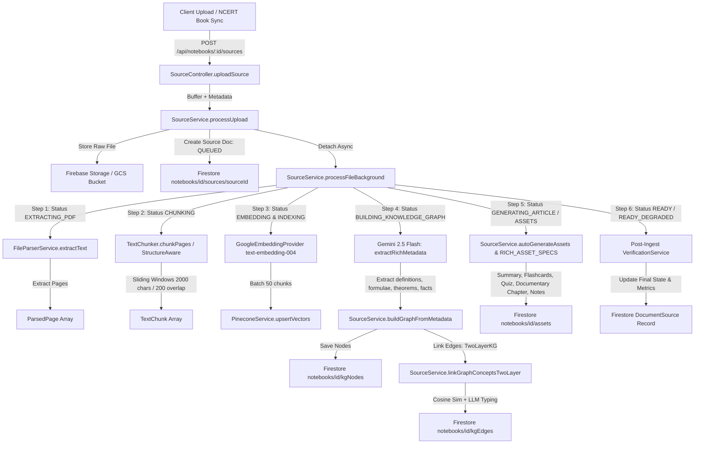
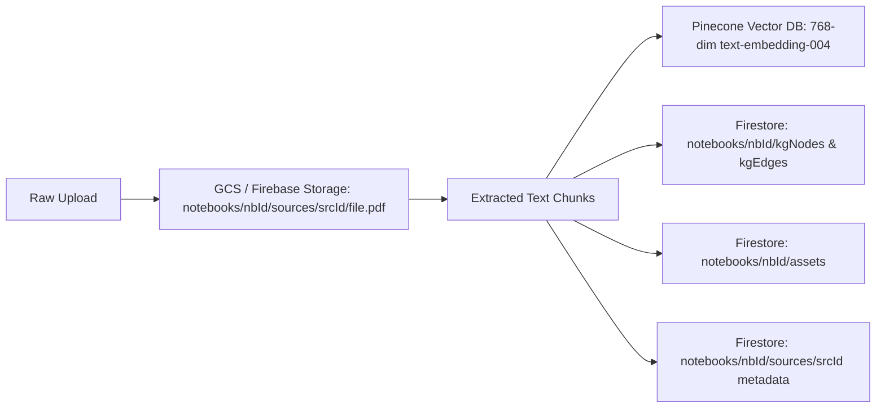
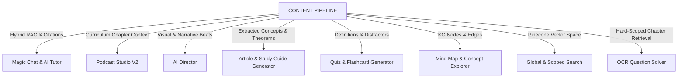

# SCHOLARLY CONTENT PIPELINE: COMPREHENSIVE ARCHITECTURAL AUDIT
**Document Version:** 1.0.0  
**Status:** Complete Forensic Assessment  
**Author:** Lead Software Architect & Principal Systems Engineer  
**Date:** March 2026  

---

## Executive Summary & Mission Scope

The **Content Pipeline** is the foundational **Knowledge Ingestion, Understanding, and Indexing Engine** of the Scholarly AI platform. It serves as the single source of truth transforming raw, heterogeneous educational media (PDFs, NCERT textbooks, DOCX notes, scanned question papers, audio lectures, YouTube videos, and web articles) into structured, semantically enriched, and indexed **AI-Ready Knowledge Artifacts**.

This audit conducts a deep forensic analysis of the current Scholarly codebase (`backend-firestore`, `frontend`, shared types, and RAG services) across all 21 system dimensions (A through U). It identifies operational bottlenecks, structural couplings, duplication risks, and safety seams to guarantee zero regression across downstream features (**Magic Chat**, **AI Tutor**, **Podcast Studio**, **AI Director**, **Assessment Engine**, and **OCR Question Solver**).

---

## Section A: Existing Ingestion Flow & Code Walkthrough

The current ingestion lifecycle is orchestrated primarily as a monolithic background job inside [source.service.ts](file:///d:/scholarly/backend-firestore/src/services/source.service.ts).

### Ingestion Flow Diagram


### Critical Trace Points
1. **Entry Controller:** `SourceController.uploadSource` ([source.controller.ts](file:///d:/scholarly/backend-firestore/src/controllers/source.controller.ts#L5-L19)) receives `multipart/form-data`, validates authenticated user, and hands off buffer to `sourceService.processUpload`.
2. **Persistence Seam:** Storage path defaults to `notebooks/${notebookId}/sources/${sourceId}/${file.originalname}` in Firebase Cloud Storage.
3. **Execution Detachment:** `processUpload` starts `processFileBackground` via un-awaited Promise execution (`void this.processFileBackground(...)`).

---

## Section B: Supported File Types & Extraction Engines

| Format | Current Library / Engine | Extraction Quality | Known Limitations |
| :--- | :--- | :--- | :--- |
| **PDF (Digital)** | `pdf-parse` (pdfjs-dist fork) in [fileParser.service.ts](file:///d:/scholarly/backend-firestore/src/services/fileParser.service.ts#L46-L74) | Good for plain continuous text; poor for multi-column academic layouts | Strips bounding boxes, ignores embedded vector formulas, breaks table structures into scrambled strings |
| **PDF (Scanned/Image)** | Fallback to Gemini 2.5 Flash Vision OCR | High visual accuracy for Indian curriculum and multilingual text | Rate limits under bulk batch processing; lacks token bounding boxes |
| **DOCX** | `mammoth` | Good for plain text and headers | Ignores complex SmartArt, equations embedded as OMML |
| **TXT / Markdown** | UTF-8 direct buffer string parsing | Perfect | No structure parsing beyond raw text |
| **Images (PNG/JPG)** | Gemini 2.5 Flash Multimodal Vision (`ScanService`) | High quality transcription and math LaTeX recognition | Only single-image on-demand scan; no pipeline ingestion queue |
| **EPUB** | *Not currently supported* | N/A | Missing in current parser |
| **Audio / Video / YouTube**| Handled partially via `populateYouTubeAssets` (metadata search only) | No direct Whisper/speech-to-text ingestion of uploaded MP3/MP4 | Audio files cannot be ingested as direct knowledge sources |

---

## Section C: Document Extraction Engine & Structure Detection

* **Current Implementation:** `FileParserService` ([fileParser.service.ts](file:///d:/scholarly/backend-firestore/src/services/fileParser.service.ts)) extracts text by iterating through PDF pages, splitting page text on `\n\n\n\n` delimiters.
* **Structure Detection Gaps:**
  * No AST (Abstract Syntax Tree) representation for sections, headings (`H1`, `H2`, `H3`), callout boxes, or exercises.
  * Formulae are extracted as raw ASCII without automatic standardisation to LaTeX `$...$` or `$$...$$`.
  * Diagrams, figures, and charts are omitted without visual captioning or image embeddings.

---

## Section D: OCR Capabilities

1. **On-Demand OCR:** Implemented in `ScanService.streamScan` ([scan.service.ts](file:///d:/scholarly/backend-firestore/src/services/scan.service.ts#L51-L117)) using `GeminiProvider.extractQuestionFromImage`.
2. **Textbook Scanning:** Scans cropped bounding boxes of textbook pages, extracts question text, retrieves chapter context, and streams step-by-step solutions with LaTeX rendering.
3. **Pipeline Ingestion OCR:** Ingestion pipeline detects empty `pdf-parse` buffers and triggers fallback OCR via Gemini Vision, but lacks pagination batching for >50 page scanned books.

---

## Section E: Chunking Strategy & Token Boundaries

Scholarly currently maintains two chunking implementations:

1. **Legacy Character Chunker (`TextChunker` in [rag/ingestion.service.ts](file:///d:/scholarly/backend-firestore/src/services/rag/ingestion.service.ts)):**
   * Size: 2,000 characters.
   * Overlap: 200 characters.
   * Boundary: Splits on sentences/paragraphs across raw page streams.
   * Limitation: Blind to semantic section breaks, table boundaries, and mathematical proofs.
2. **Structure-Aware Chunker (`StructureChunker` in [rag/structureChunker.service.ts](file:///d:/scholarly/backend-firestore/src/services/rag/structureChunker.service.ts)):**
   * Size: 600–800 tokens (`cl100k_base` approximation).
   * Overlap: 100 tokens.
   * Preserves heading breadcrumb hierarchy (`Chapter > Section > Subsection`) in chunk metadata.
   * Flag-gated under `featureFlags.structureAwareChunking`.

---

## Section F: Embedding Generation & Models

* **Embedding Model:** Google `text-embedding-004` (768 dimensions).
* **Provider Wrapper:** `GoogleEmbeddingProvider` ([rag/googleEmbedding.provider.ts](file:///d:/scholarly/backend-firestore/src/services/rag/googleEmbedding.provider.ts)).
* **Throttling & Batching:** Chunks are processed in batches of 50 with exponential backoff (`withRetry`) to respect Google Cloud API rate limits.
* **Context Normalization:** Vector IDs follow strict deterministic naming: `${sourceId}_chunk_${chunkIndex}` allowing zero-latency targeted vector fetching and repair.

---

## Section G: Vector Database Architecture (Pinecone)

* **Service:** `PineconeService` ([rag/pinecone.service.ts](file:///d:/scholarly/backend-firestore/src/services/rag/pinecone.service.ts)).
* **Namespace Isolation:** Scoped to `env.PINECONE_NAMESPACE` (defaults to `scholarly-production` or `scholarly-dev`).
* **Metadata Schema Indexed:**
  ```typescript
  interface VectorMetadata {
    notebookId: string;
    sourceId: string;
    userId: string;
    chunkIndex: number;
    text: string;
    chapter?: string;
    pageNumber?: number;
    difficulty?: 'Easy' | 'Medium' | 'Hard';
    tags?: string[];
    sourceTitle: string;
    authorityScore?: number;
    metadataVersion: number;
  }
  ```
* **Filter Capabilities:** Sub-millisecond hard-scoped filtering on `notebookId` and `sourceId` enabling targeted chapter-level RAG.

---

## Section H: Knowledge Graph Generation & Storage

* **Extraction Engine:** `SourceService.extractRichMetadata` queries Gemini 2.5 Flash with a structured JSON schema extracting:
  * Key Definitions (`term`, `definition`)
  * Formulae and Theorems
  * Notable People, Places, Dates
  * Learning Objectives and Estimated Study Times
* **Node Storage:** Firestore collection `notebooks/{notebookId}/kgNodes`.
* **Edge Linking Strategy:** `SourceService.linkGraphConceptsTwoLayer` operates a dual-layer approach:
  1. *Layer 1 (Deterministic Similarity):* Cosine distance between concept embeddings thresholded at >0.78.
  2. *Layer 2 (Semantic Typing):* Gemini 2.5 Flash assigns edge types (`PREREQUISITE_OF`, `RELATED_TO`, `PART_OF`, `OPPOSITE_OF`, `CAUSES`) using compact 1-character token-efficient indexing.
* **Storage:** Firestore collection `notebooks/{notebookId}/kgEdges`.

---

## Section I: Content Metadata Schema & Document Lineage

Documents are modeled via `DocumentSource` ([types/notebook.ts](file:///d:/scholarly/backend-firestore/src/types/notebook.ts#L87-L154)):
```typescript
export interface DocumentSource {
  id: string;
  userId: string;
  notebookId: string;
  title: string;
  originalName?: string;
  type: string;
  mimeType?: string;
  sizeBytes: number;
  storagePath?: string;
  gcsPath?: string;
  status: ProcessingStatus;
  chunksExtracted: number;
  conceptsExtracted: number;
  authorityScore: number;
  processingDurationMs: number;
  createdAt: number;
  metadata?: ExtractionMetadata;
  verification?: SourceVerificationSummary;
  verificationVersion?: number;
  metadataVersion?: number;
  chunkVersion?: number;
  lastHeartbeatAt?: number;
  failedAt?: number;
  failureReason?: string;
  errorDetails?: string;
}
```

---

## Section J: Validation & Quality Checks

Scholarly implements an automated post-ingestion verification suite in [rag/verification.service.ts](file:///d:/scholarly/backend-firestore/src/services/rag/verification.service.ts):
1. **Vector Completeness Check:** Confirms `chunksExtracted` matches vector count in Pinecone via batch existence probing.
2. **Metadata Integrity Check:** Ensures `metadata.definitions` and `learningObjectives` are non-empty.
3. **Asset Completeness Check:** Probes Firestore for generated `SUMMARY`, `FLASHCARDS`, `QUIZ`, and `DOCUMENTARY_ARTICLE`.
4. **Self-Healing / Repair:** If non-critical assets failed during live ingestion, `VerificationService` invokes `repairAssets` or `repairMetadataAndGraph` using vector-reconstructed text without re-downloading or re-embedding.

---

## Section K: Error Handling, Retries & Degradation Modes

* **Cockatiel Policies:** `withRetry` uses exponential backoff (initial delay 500ms, factor 2, max 4 retries).
* **Degraded Ready State (`READY_DEGRADED`):** If vector indexing succeeds but an auxiliary asset (e.g. Documentary Chapter LLM call) fails, the document transitions to `READY_DEGRADED`. Downstream RAG and Chat function normally while logging diagnostics.
* **Watchdog Protection:** Background cron detects sources stuck in `PROCESSING` / `CHUNKING` longer than 15 minutes and transitions them to `FAILED` with actionable `failureReason` (`STUCK_TIMEOUT`, `MISSING_SOURCE_FILE`, `PERMISSION_DENIED`).

---

## Section L: Storage Architecture



---

## Section M: Sync vs Async Processing

* **Synchronous Phase:** File upload validation, multer storage, GCS buffer write, initial Firestore document creation (`QUEUED`). Returns HTTP 201 in <300ms.
* **Asynchronous Phase:** Text parsing, OCR, chunking, embedding, Pinecone indexing, Knowledge Graph node/edge extraction, and educational asset generation executed in detached background worker.

---

## Section N: Queue and Worker Infrastructure

Scholarly currently possesses two execution runners:
1. **Durable BullMQ + Redis Queue:** `BackgroundQueue` ([core/workflow/jobs/BackgroundQueue.ts](file:///d:/scholarly/backend-firestore/src/core/workflow/jobs/BackgroundQueue.ts)) with dedicated queues: `background-jobs`, `media-jobs`, `notification-jobs`.
2. **In-Process Fallback Runner:** `BackgroundExecutor` ([core/workflow/jobs/BackgroundExecutor.ts](file:///d:/scholarly/backend-firestore/src/core/workflow/jobs/BackgroundExecutor.ts)) providing in-memory concurrency control (concurrency: 4) when Redis is disabled (`DISABLE_WORKERS=true`).
3. **Current Ingestion Seam:** Document ingestion currently runs as an un-awaited background Promise in `source.service.ts` rather than a formalized BullMQ job. **This is a primary modernization target.**

---

## Section O: Real-Time Updates & Progress Tracking

* **Status Progression:** `QUEUED` → `EXTRACTING_PDF` → `CHUNKING` → `EMBEDDING` → `INDEXING` → `BUILDING_KNOWLEDGE_GRAPH` → `GENERATING_ARTICLE` → `GENERATING_FLASHCARDS` → `READY`.
* **Frontend Real-Time Binding:** Client hooks (`useDocuments`, `useBookLibrary`, `useNotebook`) bind to Firestore via `onSnapshot` listeners, updating UI progress bars reactively without HTTP polling.

---

## Section P: Downstream Consumers Mapping



1. **Magic Chat & AI Tutor (`ChatService`):** Queries `RetrievalService` with hybrid dense vector + sparse BM25 + Cohere rerank and `GraphRetrievalService` for 2-hop concept expansions.
2. **Podcast Studio (`PodcastEngineService`):** `SourceResolver` extracts GroundingBriefs from notebook sources to feed multi-speaker script generation.
3. **OCR Question Solver (`ScanService`):** Uses chapter-level `sourceId` Pinecone filter to retrieve exact textbook passages behind cropped question images.

---

## Section Q: Performance Bottlenecks & Scale Limits

1. **Monolithic Ingestion Execution:** Ingestion runs as an unmanaged detached promise; process restarts during ingestion cause zombie `PROCESSING` documents.
2. **Sequential LLM Asset Generation:** Part 8 rich assets are generated one by one in a serial loop, increasing total processing time to 45–90s for large chapters.
3. **In-Memory PDF Parsing:** Large 200MB+ textbook PDFs hold large byte buffers in node process memory.

---

## Section R: Security, Auth & Multi-Tenancy

* **Authentication:** Firebase Auth ID Token verified via `requireAuth` middleware.
* **Authorization & Multi-Tenancy:**
  * Private notebooks: Strictly scoped to `userId == req.user.uid` or validated in `notebook.editors` / `notebook.viewers`.
  * Public NCERT Curriculum: Accessible to all authenticated users via `bookLibraryController` with read-only enforcement.
* **Vector Isolation:** Pinecone queries include metadata filter `{ notebookId: { $eq: notebookId } }` preventing cross-tenant leakage.

---

## Section S: Duplication Analysis & Existing Asset Matrix

| Capability | Existing Infrastructure Component | Recommendation |
| :--- | :--- | :--- |
| **Vector DB** | `PineconeService` ([rag/pinecone.service.ts](file:///d:/scholarly/backend-firestore/src/services/rag/pinecone.service.ts)) | **REUSE AS IS** |
| **Embeddings** | `GoogleEmbeddingProvider` (768-dim `text-embedding-004`) | **REUSE AS IS** |
| **RAG Retrieval** | `RetrievalService` (hybrid + Cohere rerank) | **REUSE AS IS** |
| **Knowledge Graph** | `notebookRepository` (kgNodes, kgEdges collections) | **REUSE AS IS** |
| **Queue Broker** | `BackgroundQueue` (BullMQ + Redis) | **REUSE & ENRICH** |
| **OCR Vision** | `GeminiProvider.extractQuestionFromImage` | **REUSE AS CORE OCR** |
| **File Parser** | `FileParserService` | **EXTRACT & EXTEND** into modular pipeline stages |

---

## Section T: Safe Seam & Abstraction Boundaries

To protect downstream modules:
1. **Do Not Touch:** `ChatService`, `WorkflowEngine`, `PodcastEngineService`, `ScanService`, `PineconeService`.
2. **Interface Seam:** The new Content Pipeline module will implement an autonomous, modular service interface (`IContentPipeline`) while exposing backward-compatible delegates for `sourceService.processUpload` and `bookLibraryService`.
3. **Data Contract Invariance:** The output schema in Firestore (`notebooks/{id}/sources/{sourceId}`, `kgNodes`, `kgEdges`, `assets`) and Pinecone metadata remains 100% backward compatible.

---

## Section U: Summary — What Stays, What Changes, What Is New

* **What Stays:**
  * Pinecone vector indexing schema and namespace conventions.
  * Firestore collections and document structures.
  * LLM providers (Gemini 2.5 Flash, Google Embeddings, Cohere Reranker).
  * Downstream RAG consumers and chat streaming endpoints.
* **What Changes (Refactored):**
  * Monolithic `SourceService.processFileBackground` decomposed into discrete, testable pipeline stages.
  * Serial asset generation parallelized via worker tasks.
* **What Is New:**
  * Formalized `ContentPipelineModule` with modular stage pipeline (`IngestionStage`, `ExtractionStage`, `ChunkingStage`, `EmbeddingStage`, `KnowledgeGraphStage`, `VerificationStage`).
  * Dedicated BullMQ queue `content-pipeline-jobs` with job recovery, progress reporting, and pause/resume capability.
  * Multi-format support (EPUB, audio transcript, web URL scraping).
  * Clean UI Content Pipeline dashboard for system-wide document status and ingestion telemetry.
