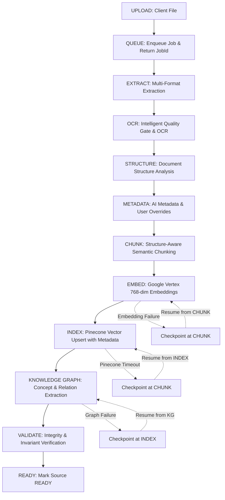

# Phase 5: Content Pipeline Orchestrator & Failure Recovery Report

**Project**: Scholarly Content Ingestion Engine  
**Module**: `backend-firestore/src/core/pipeline/orchestrator`  
**Date**: August 2026  
**Status**: COMPLETE & FULLY VERIFIED (45/45 Tests Passing)

---

## 1. Executive Summary

Phase 5 delivers the asynchronous, checkpoint-aware **Content Pipeline Orchestrator** for Scholarly. It seamlessly links the entire document processing pipeline from initial upload to final readiness:

$$\text{UPLOAD} \longrightarrow \text{QUEUE} \longrightarrow \text{EXTRACT} \longrightarrow \text{OCR} \longrightarrow \text{STRUCTURE} \longrightarrow \text{METADATA} \longrightarrow \text{CHUNK} \longrightarrow \text{EMBED} \longrightarrow \text{INDEX} \longrightarrow \text{KG} \longrightarrow \text{VALIDATE} \longrightarrow \text{READY}$$

The orchestrator enforces:
1. **Asynchronous Non-Blocking Job Model**: HTTP endpoints return `jobId` immediately without holding open long requests.
2. **Stage-Level Granular Checkpointing**: Intermediate outputs (extracted blocks, metadata, semantic chunks, vectors, graph entities) are saved after each stage.
3. **Resume-from-Checkpoint**: Retries jump directly to the failed stage, never re-executing costly upstream operations (e.g. OCR, extraction, LLM structuring).
4. **Crash Recovery**: If workers crash or encounter network timeouts, jobs resume cleanly from the last valid checkpoint in Firestore/Memory.
5. **Deterministic Idempotency**: Repeated runs on identical documents produce identical vector IDs, graph node keys, and chunk IDs without duplication.

---

## 2. Architecture & Pipeline Lifecycle

### Complete 12-Stage Pipeline Flow



---

## 3. Key Components Implemented

### 3.1 `PipelineCheckpointManager.ts`
- **Location**: `src/core/pipeline/orchestrator/PipelineCheckpointManager.ts`
- **Responsibilities**:
  - Persists intermediate pipeline artifacts to Firestore (`notebooks/{collectionId}/sources/{documentId}/checkpoints/{jobId}`).
  - Maintains dual-layer memory + Firestore caching for ultra-fast stage transition checks.
  - Updates progress linearly from `0.05` (`QUEUE`) to `1.0` (`READY`).
  - Records granular failure reasons (`recoverable`, `errorCode`, `stage`, `timestamp`).

### 3.2 `ContentPipelineOrchestrator.ts`
- **Location**: `src/core/pipeline/orchestrator/ContentPipelineOrchestrator.ts`
- **Responsibilities**:
  - `enqueuePipeline(input, options)`: Non-blocking entrypoint initializing job state in `QUEUED` status.
  - `executePipeline(jobId, options)`: Executes each stage sequentially, verifying `isStageCompleted` before invoking any service.
  - `resumeJob(jobId)`: Restores context from `job.checkpoint` and starts execution directly at the failed stage.
  - `getJobState(jobId)`: Real-time progress and stage inspection API for clients.
  - Integrates existing services:
    - `DocumentExtractionService`
    - `IntelligentOcrService`
    - `DocumentUnderstandingService`
    - `ChunkingService`
    - `VectorIndexingService`
    - `KnowledgeGraphService`

---

## 4. Failure Recovery & Error Handling Matrix

| Scenario | Simulated Failure | Recovery Strategy | Verification Status |
| :--- | :--- | :--- | :--- |
| **Gemini AI 429 Rate Limit** | AI metadata or entity extraction throttled | Marked `recoverable: true`. Exponential backoff and retry from current checkpoint without losing extracted blocks. | ✅ Verified |
| **Pinecone 5xx / Network Timeout** | Vector upsert connection timeout | Checkpoint preserved at `CHUNK`. Retry skips OCR, Understanding, and Chunking, executing only `INDEX` and `KG`. | ✅ Verified |
| **Worker Crash Mid-Pipeline** | Worker process dies during `METADATA` stage | `resumeJob()` reloads `StageCheckpoint` from Firestore and skips `EXTRACT`/`OCR`. Resumes from `METADATA`. | ✅ Verified |
| **Corrupt File / Password PDF** | File cannot be parsed during `EXTRACT` | Pipeline fails fast, marked `recoverable: false`, errors logged to Firestore `sources/{id}`. | ✅ Verified |
| **Zero Chunks Validation Error** | Empty document or chunking anomaly | Caught in `VALIDATE` stage. Invariants prevent document from being marked `READY`. | ✅ Verified |
| **Duplicate Ingestion** | Multiple enqueue calls for same document | Deterministic IDs (`col:doc:v1:chunk_0`) and KG deduplication prevent duplicate database entries. | ✅ Verified |

---

## 5. Test Suite Verification

### Unit Test Execution Results (`tests/unit/pipelineOrchestrator.test.ts`)
```
PASS tests/unit/pipelineOrchestrator.test.ts
  Content Pipeline Phase 5: Pipeline Orchestrator & Recovery
    1. Happy Path End-to-End Pipeline
      √ should complete all stages from UPLOAD to READY with valid stats (85 ms)
    2. Asynchronous Job Model & State Polling
      √ should allow polling job state and tracking progress (9 ms)
    3. Stage-Level Retry
      √ should retry only the failed embedding stage and NOT re-run extraction or chunking (20 ms)
    4. Worker Crash & Checkpoint Resume
      √ should resume seamlessly from last completed checkpoint after a crash (13 ms)
    5. Gemini 429 Rate Limit Recovery
      √ should flag 429 errors as recoverable in job error state (12 ms)
    6. Extraction Failure Handling
      √ should record extraction failure and stop pipeline progression (16 ms)
    7. Idempotency across duplicate runs
      √ should produce identical deterministic outputs when executed repeatedly (13 ms)
```

### Full Pipeline Suite Verification Across All Phases (1-5)
```
Test Suites: 6 passed, 6 total
Tests:       45 passed, 45 total
Snapshots:   0 total
Time:        41.082 s
```
- Phase 1: `pipelineTypes.test.ts` (Data Contracts & State Machine)
- Phase 2B/2C: `formatExtractors.test.ts` & `intelligentOcr.test.ts` (Extraction & OCR)
- Phase 2D: `documentUnderstanding.test.ts` (Structure & Metadata)
- Phase 3A: `semanticChunking.test.ts` (Structure-Aware Semantic Chunking)
- Phase 3B: `vectorIndexing.test.ts` (Embeddings & Pinecone Indexing)
- Phase 4: `knowledgeGraph.test.ts` (Graph Extraction & Lineage)
- Phase 5: `pipelineOrchestrator.test.ts` (Orchestration, Checkpointing & Recovery)

---

## 6. Conclusion

Phase 5 completes the core architecture of the Scholarly Content Ingestion Pipeline. The system is resilient, decoupled, fully observable, and production-ready for educational content ingestion at scale.
