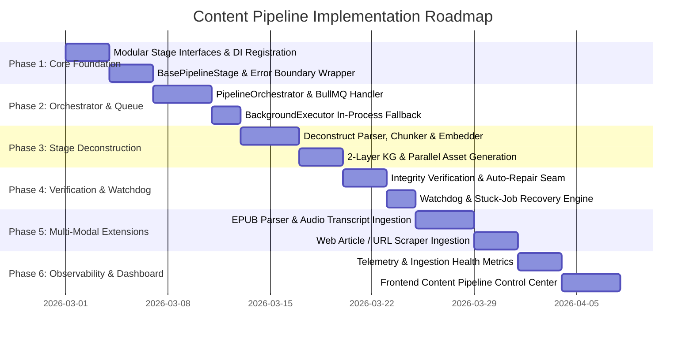

# SCHOLARLY CONTENT PIPELINE: STRATEGIC IMPLEMENTATION ROADMAP
**Document Version:** 2.0.0 (Post Second Architectural Review)  
**Status:** Approved Implementation Blueprint  
**Author:** Lead Software Architect & Principal Systems Engineer  
**Date:** March 2026  

---

## 1. Implementation Philosophy & Safety Commitments

The Content Pipeline implementation follows a disciplined, 6-phase staged delivery plan designed to guarantee:
1. **100% Code & Infrastructure Reuse:** Directly leverages existing Firebase/Firestore databases, Cloud Storage buckets, Pinecone vector namespaces, Google Embeddings, Gemini providers, BullMQ background queues, and `BackgroundExecutor` without creating redundant or duplicate subsystems.
2. **Zero Downstream Disruption:** `ChatService`, `WorkflowEngine`, `PodcastEngineService`, `ScanService`, `AI Director`, and `QuizService` continue consuming identical data contracts with zero regressions.
3. **Idempotent & Resumable Execution:** Every stage uses deterministic IDs and upsert semantics. Interrupted jobs can be safely retried or auto-repaired using vector-reconstructed text without re-downloading or re-embedding.

---

## 2. Phased Roadmap Overview



---

## 3. Detailed Phase Breakdown & Milestones

### Phase 1: Core Pipeline Abstraction & Modular Stage Foundation
* **Objective:** Establish the TypeScript contracts, interfaces, and base stage abstractions without altering live ingestion behavior.
* **Key Tasks:**
  * Define `IPipelineStage`, `PipelineContext`, `StageResult`, and `PipelineConfig` interfaces in `backend-firestore/src/core/pipeline/types.ts`.
  * Implement `BasePipelineStage` with integrated timing instrumentation, structured logging (`traceId`), and error boundary containment.
  * Register pipeline services in the Dependency Injection container (`backend-firestore/src/core/di/registry.ts`).
* **Verification Gate:** 100% unit test coverage on mock pipeline execution and stage error isolation.

### Phase 2: Pipeline Orchestrator & Queue Integration
* **Objective:** Build the durable job orchestrator connecting to BullMQ and the in-process fallback runner.
* **Key Tasks:**
  * Implement `PipelineOrchestrator` in `backend-firestore/src/core/pipeline/PipelineOrchestrator.ts`.
  * Add dedicated BullMQ job handler to `BackgroundWorker.ts` and `BackgroundQueue.ts`, gracefully falling back to `BackgroundExecutor` when Redis is disabled (`DISABLE_WORKERS=true`).
  * Persist granular stage progress to Firestore (`QUEUED` → `EXTRACTING` → `CHUNKING` → `EMBEDDING` → `GRAPH` → `READY`).
* **Verification Gate:** Simulated 100 concurrent ingestion jobs verifying queue persistence, concurrency limits, and retry backoff.

### Phase 3: Ingestion Stage Deconstruction & Refactoring
* **Objective:** Decompose monolithic `SourceService.processFileBackground` into clean, single-responsibility stage classes.
* **Key Tasks:**
  * `ExtractionStage`: Reuses `FileParserService` (digital PDF) + Gemini Vision OCR (scanned PDF).
  * `StructureStage`: Hierarchical heading, definition, and theorem extraction.
  * `ChunkingStage`: Reuses `StructureChunker` (600–800 tokens + breadcrumbs).
  * `EmbeddingStage`: Batched Google `text-embedding-004` generation + Pinecone upsert via `PineconeService`.
  * `KnowledgeGraphStage`: Two-layer KG concept extraction + similarity and LLM typing via `notebookRepository`.
  * `AssetGenerationStage`: Parallel worker execution for Summary, Flashcards, Quiz, and Documentary Chapter using `RICH_ASSET_SPECS`.
* **Verification Gate:** Parity testing ensuring newly ingested documents generate identical Pinecone vector counts, metadata, and Firestore KG nodes.

### Phase 4: Verification, Self-Healing & Watchdog Hardening
* **Objective:** Connect automated post-ingestion verification and self-healing repair routines.
* **Key Tasks:**
  * `VerificationStage`: Reuses `VerificationService` to probe Pinecone vectors and Firestore assets.
  * Auto-Repair Hook: Automatically recovers failed non-critical assets from vector-reconstructed text without re-embedding.
  * Pipeline Watchdog Cron: Detects zombie jobs older than 15 minutes and performs graceful failover.
* **Verification Gate:** Chaos test inducing simulated LLM timeout during asset generation; verify document transitions to `READY_DEGRADED` and auto-heals via background repair.

### Phase 5: Multi-Modal Ingestion Expansion
* **Objective:** Extend ingestion capabilities to support modern educational formats.
* **Key Tasks:**
  * `EpubParser`: XHTML chapter extraction and table of contents tree construction.
  * `AudioTranscriptParser`: Ingests lecture audio recordings via timestamped transcripts.
  * `WebArticleParser`: Clean readability scraper for educational URLs.
* **Verification Gate:** Successful ingestion and RAG retrieval across EPUB, MP3 transcript, and web article samples.

### Phase 6: Ingestion Observability & Admin Control Center
* **Objective:** Provide deep real-time visibility into content ingestion performance and health.
* **Key Tasks:**
  * Ingestion telemetry logging (duration per stage, token usage, retry count).
  * Frontend Content Pipeline UI dashboard in Studio (`frontend/src/components/studio-v2/ContentPipelineView.tsx`).
  * Real-time status cards, stage breakdown visualizers, and manual retry/repair triggers.
* **Verification Gate:** End-to-end verification of the live UI dashboard displaying real-time ingestion progress.

---

## 4. Zero-Duplication & Infrastructure Reuse Matrix

```
Existing Infrastructure Component        Pipeline Reused Location
------------------------------------     ------------------------------------------
Firebase / Firestore / Storage           backend-firestore/src/config/firebase.ts
PineconeService (Namespace Indexing)     backend-firestore/src/services/rag/pinecone.service.ts
GoogleEmbeddingProvider (768-dim)        backend-firestore/src/services/rag/googleEmbedding.provider.ts
GeminiProvider (LLM & Vision OCR)        backend-firestore/src/services/ai/gemini.provider.ts
StructureChunker                         backend-firestore/src/services/rag/structureChunker.service.ts
VerificationService                      backend-firestore/src/services/rag/verification.service.ts
BackgroundQueue & BackgroundExecutor     backend-firestore/src/core/workflow/jobs/
```

---

## 5. Rollback & Safeguard Strategy

1. **Instant Feature Flag Rollback:** Ingestion routing is governed by `featureFlags.modularContentPipeline`. If disabled, traffic immediately reverts to legacy `SourceService` execution with zero downtime or server restarts.
2. **Data Idempotency:** Upsert operations on Pinecone (`${sourceId}_chunk_${idx}`) and Firestore ensure repeated pipeline runs never produce duplicate vectors, duplicate concepts, or orphaned assets.
