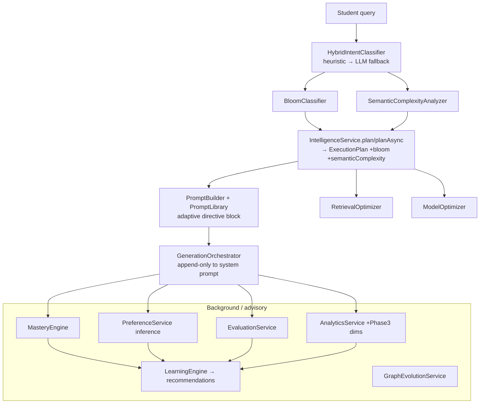
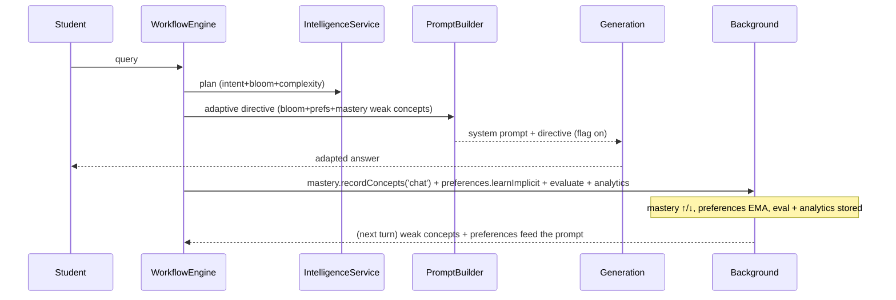
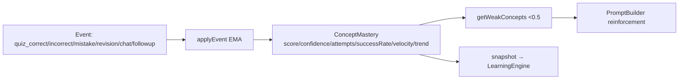
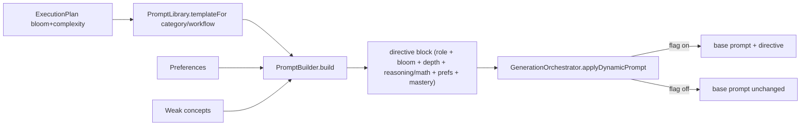

# Phase 3 — The Adaptive Tutor

> Phase 2 gave Scholarly a decision layer (the `ExecutionPlan`). Phase 3 makes that layer
> **educational and self-improving**: it classifies the cognitive demand of every question,
> personalizes the prompt, tracks per-concept mastery, infers how each student likes to learn,
> closes the feedback loop into advisory recommendations, and can tune retrieval/model/graph — all
> **additive, flag-gated, fail-open, and with no autonomous production mutation**.

## Design contract (unchanged from Phase 2, re-verified)

- **Extend, never replace.** Every Phase-2 service and the whole GraphRAG pipeline are intact.
- **Additive + flag-gated.** With all flags at defaults, execution is byte-for-byte identical.
- **Heuristics first.** LLMs are used only for the ambiguous tail, cached, behind a flag.
- **No autonomous mutation.** Learning produces recommendations; a human/flagged applier acts.

### Feature flags (Phase 3)

| Flag (getter) | Env var | Default | Effect |
|---|---|---|---|
| `bloomClassification` | `ENABLE_BLOOM` | **ON** | Compute Bloom + semantic complexity on the plan (observe-only, ~0ms). |
| `hybridIntent` | `ENABLE_HYBRID_INTENT` | OFF | LLM intent fallback for low-confidence queries (cached). |
| `dynamicPrompt` | `ENABLE_DYNAMIC_PROMPT` | OFF | Append the adaptive directive block to the system prompt. |
| `mastery` | `ENABLE_MASTERY` | OFF | Track per-concept mastery + reinforce weak concepts. |
| `preferenceInference` | `ENABLE_PREFERENCE_INFERENCE` | OFF | Infer style preferences via weighted EMA. |
| `retrievalOptimization` | `ENABLE_RETRIEVAL_OPT` | OFF | Consult the RetrievalOptimizer. |
| `modelOptimization` | `ENABLE_MODEL_OPT` | OFF | Consult the ModelOptimizer. |
| `graphEvolution` | `ENABLE_GRAPH_EVOLUTION` | OFF | Run the read-only graph-evolution scan. |

Only `bloomClassification` is on by default and it is pure/observe-only (nothing consumes its
output unless another flag is on), so the default runtime is unchanged.

---

## 1. Architecture — the Adaptive Intelligence Layer



Everything in the `LEARN` box runs off the critical path (BackgroundExecutor) or is advisory.

---

## 2. Student learning lifecycle



The loop tightens every turn: weak concepts get reinforced, preferences shape depth/format,
evaluations + analytics accumulate the evidence the LearningEngine reflects on.

---

## 3. Mastery model



`masteryScore ← prev + α·(target − prev)` per event (α from 0.08 chat → 0.4 quiz). Trend from an
EMA of deltas. A single chat exposure barely moves the needle; graded quiz events move it decisively.

---

## 4. Prompt generation lifecycle



The builder never rewrites the production prompt; it **appends** an explainable directive block.

---

## 5. Feedback learning lifecycle

```mermaid
flowchart LR
  FB[Feedback: thumbs/regenerate/copy/followup/citation] --> SUM[FeedbackService.summarize]
  SUM --> LE[LearningEngine.analyze]
  EV[Evaluations] --> LE
  AN[Analytics] --> LE
  MA[Mastery snapshot] --> LE
  PP[Prompt performance] --> LE
  LE --> R[Recommendation[] routing/retrieval/prompt/cache/model/mastery/personalization]
  R --> H[Human / future flagged applier]
```

`analyze()` is pure and emits recommendations only — the self-improvement loop stays observable
and reversible.

---

## 6. Bloom routing matrix

| Bloom level | Example stem | Directive effect |
|---|---|---|
| Remember | "What is DNA?" | Precise fact first, crisp. |
| Understand | "Explain DNA replication" | Plain language + analogy + one example. |
| Apply | "Solve this genetics problem" | Reusable method, step by step. |
| Analyze | "Compare mitosis and meiosis" | Break into parts, comparison table. |
| Evaluate | "Critique this solution" | Criteria → trade-offs → judgement. |
| Create | "Design an experiment" | Scaffold a framework, don't hand a finished artifact. |

## 7. Dynamic prompt decision matrix

| Signal | Source | Directive added |
|---|---|---|
| Bloom level | BloomClassifier | cognitive-level instruction |
| complexity ≤2 / ≥4 or comprehension | SemanticComplexity / memory | beginner ↔ advanced depth |
| reasoningDepth>0.6 or synthesis>0.5 | SemanticComplexity | step-by-step reasoning scaffold |
| mathematicalReasoning>0.5 | SemanticComplexity | show working + units |
| language / depth / examples / diagrams / tables | Preferences | format directives |
| weak concepts (mastery<0.5) | MasteryEngine | reinforce prerequisites first |
| mastery% < 40 | StudentContext | reinforce fundamentals + check understanding |

## 8. Retrieval optimization matrix

| History signal | Adjustment |
|---|---|
| chunkUtilization < 0.2 | top-k − 4 (over-fetching) |
| recall < 0.5 or nDCG < 0.5 | top-k + 5, reranker on |
| hallucinationRisk > 0.3 (graph strategies) | graph depth + 1, expansion on |
| graphContribution < 0.1 | disable graph expansion |
| retrievalConfidence < 0.4 | reranker on |
| < 10 samples | defaults (today's GraphRAG params) |

## 9. Model optimization matrix

| Signal | Decision |
|---|---|
| reasoning unavailable/unhealthy | → fast (base AIProvider) |
| context tokens > token budget | → fast |
| cost budget ≤ 0 | → fast |
| complexity ≥4 / ≤2 / else | reasoning / fast / balanced |
| latency > 8s and complexity ≤3 | downgrade one tier |
| historical quality < 0.5 and complexity ≥3 | upgrade to reasoning |

Default (flag off or no signals): reasoning → ReasoningProvider (today's answer model).

---

## 10. AI observability schema

`intelligence_analytics/{autoId}` now carries the Phase-3 dimensions (all additive):

```jsonc
{
  "category": "comparison", "workflow": "concept", "model": "reasoning (default)",
  "retrievalStrategy": "graphrag", "graphUsed": true, "vectorUsed": true, "cacheHit": false,
  "latencyMs": 3120, "costUsd": 0.0011, "tokens": 920, "grounding": 1,
  "citationCount": 3, "confidence": 0.9,
  "bloomLevel": "analyze", "intentSource": "heuristic", "promptTemplate": "teacher",
  "promptSignals": ["bloom:analyze","depth:advanced"], "retrievalConfidence": 0.71,
  "followup": false, "diagramUsed": false, "explanationDepth": "deep",
  "avgMastery": 0.62, "learningGain": 0.03, "ts": 1752570000000
}
```

Additional stores: `users/{uid}/mastery/{conceptId}` (ConceptMastery), `users/{uid}/intelligence/preferences`
(StudentPreferences + signalConfidence), `intelligence_evaluations/{id}` (Phase 2). Trackable from
these: Bloom distribution, mastery growth + time-to-mastery, prompt-template performance, retrieval
effectiveness, model quality, engagement (follow-up/copy/citation rates), diagram usage,
explanation-depth preference, learning gain.

---

## 11. Test matrix

| Suite | Tests |
|---|---|
| adaptiveClassification (Bloom / SemanticComplexity / HybridIntent) | 11 |
| promptBuilder (+ PromptLibrary) | 7 |
| masteryEngine | 10 |
| preferenceFeedback (+ inference) | 14 |
| learningEngine (+ closed loop) | 15 |
| adaptiveOptimizers (retrieval + model) | 13 |
| graphEvolution | 9 |
| intelligence (Phase 2) | 14 |
| semanticCache (Phase 2) | 6 |
| evaluationAnalytics (+ Phase-3 dims) | 13 |
| workflowOrchestrators / generationOrchestrator | 11 / 4 |
| workflowEngineOrchestration / backgroundExecutor | 6 / 7 |

All green. `npx tsc --noEmit` and `npm run build` both clean.

---

## 12. Roadmap (next, all flagged + measured)

1. **Consume the optimizers on the hot path** — feed per-category retrieval-history rollups into
   `RetrievalOrchestrator` and provider health/latency into `GenerationOrchestrator`, behind the
   existing `retrievalOptimization` / `modelOptimization` flags, with A/B measurement.
2. **Graded mastery signals** — emit `quiz_correct/incorrect/mistake` events from the quiz/test
   engine so mastery reflects real assessment, not just chat exposure.
3. **Recommendation applier** — an audited, explicitly-flagged path that can act on high-confidence
   LearningEngine recommendations (e.g. cache threshold) with rollback.
4. **Concept-id linkage** — map `graphMeta.matchedLabels` to canonical graph concept ids so mastery
   and graph evolution share one keyspace.
5. **Graph-evolution scan job** — supply a paginated `knowledge_graph` loader + a scheduled scan
   that files recommendations to the admin dashboard.
6. **Bloom/complexity-aware model + verification routing** — let `semanticComplexity` and Bloom
   drive verification strictness and model tier once measured safe.
```
