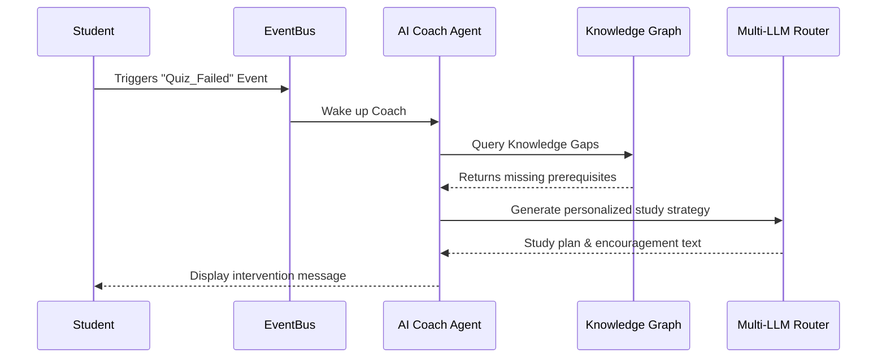

# Scholarly AI - AI Coach (Phase 6)

## 1. Overview
The AI Coach is a proactive, deeply personalized agent that monitors student progress, offers interventions, and curates customized learning pathways. It heavily utilizes the Knowledge Graph and the Global Context Engine.

## 2. Core Capabilities

### 2.1 Proactive Intervention
The AI Coach monitors the EventBus for struggle signals (e.g., multiple failed quiz attempts, long idle times in Notebook Workspace). When triggered, it initiates a dialogue or suggests alternative learning materials.

### 2.2 Global Context Engine Integration
The AI Coach reads the Global Context Engine to understand:
- Current active module.
- Upcoming deadlines.
- Exam Mode status (Coach restricts capabilities during exams to prevent cheating).

### 2.3 Dynamic Motivation
Utilizes personality-adapted prompting via the Multi-LLM Router to provide encouragement tailored to the student's psychological profile (e.g., direct & analytical vs. supportive & empathetic).

## 3. Architecture Flow

## 4. Coach Data Schema (Firestore)

| Collection / Field | Type | Description |
|--------------------|------|-------------|
| `coach_profiles` | Collection | Student-specific AI coach settings. |
| `persona_type` | String | E.g., `SOCRATIC`, `DIRECT_TUTOR`. |
| `intervention_threshold` | Number | Tolerance for failure before triggering. |
| `recent_interactions` | Array(Ref) | Links to recent chat logs or interventions. |
