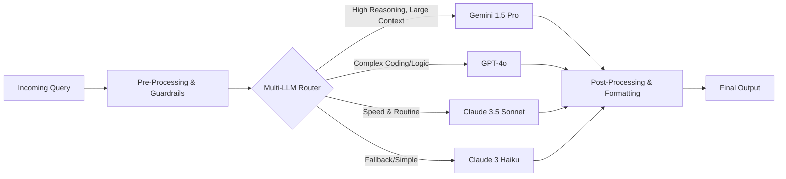

# Scholarly AI - AI Pipeline (Phase 6)

## 1. Overview
The AI Pipeline acts as the central nervous system for cognitive tasks in Scholarly AI Phase 6. It bridges the gap between raw user inputs, contextual constraints, and the generation of structured, highly accurate pedagogical outputs.

## 2. Multi-LLM Router Integration
At the heart of the pipeline is the Multi-LLM Router. By analyzing the inbound request's complexity, token count, and requested features, the router dynamically selects the optimal model.

## 3. Pipeline Stages

### 3.1 Pre-Processing & Guardrails
- **PII Scrubbing**: Removes Personally Identifiable Information.
- **Prompt Injection Defense**: Validates the prompt against malicious intent.
- **Context Injection**: Attaches relevant state from the Global Context Engine.

### 3.2 Execution
- **Streaming Support**: Enables Server-Sent Events (SSE) for low-latency perceived generation.
- **Function Calling / Tools**: Integrates tools for the model to execute (e.g., Python execution, DB querying).

### 3.3 Post-Processing
- **JSON Validation**: Ensures output structure strictly adheres to the requested schema.
- **Hallucination Checking**: Cross-references claims against the RAG retrieved context.

## 4. Error Handling and Fallback Strategy

| Error Type | Detection Method | Fallback Action |
|------------|------------------|-----------------|
| API Timeout | Latency Threshold Exceeded | Route to secondary fast model (e.g., Haiku) |
| Rate Limit (429) | HTTP Status Code | Exponential backoff + Route to alternative provider |
| Schema Violation | JSON Schema Validator | Single retry with explicit correction prompt |
| Content Policy | Provider API Response | Return safe, canned pedagogical response |
