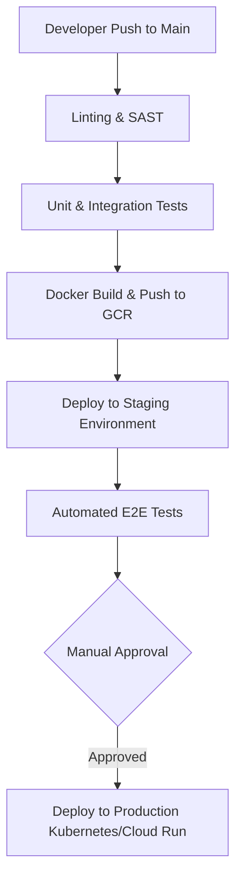

# Scholarly AI - Deployment (Phase 6)

## 1. Overview
The Phase 6 deployment strategy focuses on zero-downtime rollouts, immutable infrastructure, and multi-region availability to support a global student base.

## 2. CI/CD Pipeline
Continuous Integration and Continuous Deployment are managed via GitHub Actions.

## 3. Environment Configurations

| Environment | Purpose | Infrastructure | Firestore Strategy |
|-------------|---------|----------------|--------------------|
| **Development** | Local testing & feature dev | Local Emulators / Minikube | Local Firestore Emulator |
| **Staging** | Pre-production validation | Google Cloud Run (Scaled down) | Isolated Staging Project |
| **Production** | Live user traffic | Google Kubernetes Engine (GKE) | Production Project (Multi-Region) |

## 4. Infrastructure as Code (IaC)
All cloud resources are provisioned using Terraform. This includes:
- IAM Policies and Service Accounts.
- Firestore database rules and indexes.
- Pub/Sub topics for the EventBus.
- Redis instances for the Global Context Engine.

## 5. Rollback Strategy
Deployments utilize a Blue/Green deployment model. If error rates spike above 2% within 5 minutes of a new deployment, traffic is automatically routed back to the Blue (previous) version via the API Gateway.
