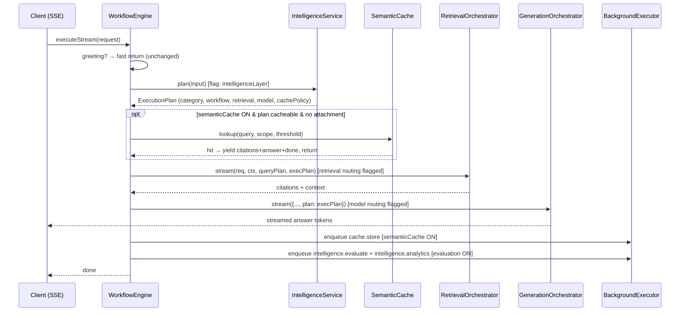
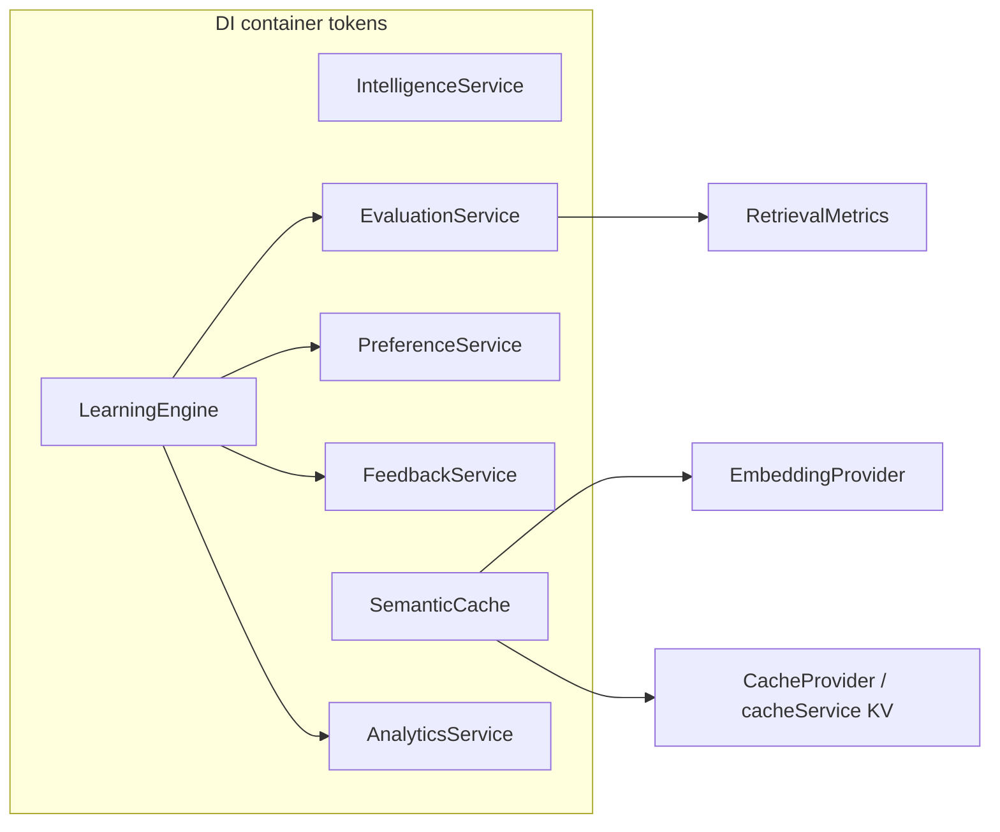

# Phase 2 — The Intelligence Layer

> The adaptive decision layer that sits in front of retrieval + generation. It makes the tutor
> **decide before it acts**: classify the query, judge its complexity, choose a workflow, a
> retrieval strategy and a model tier, decide whether the answer is cacheable, personalize, and
> then — after the turn — evaluate itself and learn from the outcome.

## Design contract (non-negotiable)

- **Additive.** No existing type, route, SSE contract, prompt, or GraphRAG behavior was changed.
- **Flag-gated.** Every consumption path is behind a feature flag. With flags at their defaults,
  execution is **byte-for-byte identical** to Phase 1.
- **Fail-open.** Every intelligence code path is wrapped so a failure degrades to today's pipeline
  (never throws into the request).
- **Advisory learning.** The LearningEngine emits recommendations only. Nothing mutates routing,
  prompts, flags, or preferences autonomously.

### Feature flags

| Flag (getter) | Env var | Default | Effect when ON |
|---|---|---|---|
| `intelligenceLayer` | `ENABLE_INTELLIGENCE_LAYER` | **ON** | Compute + log the `ExecutionPlan` (observe-only). |
| `intelligenceRetrievalRouting` | `ENABLE_INTELLIGENCE_RETRIEVAL` | OFF | RetrievalOrchestrator honors `plan.retrievalStrategy`. |
| `intelligenceModelRouting` | `ENABLE_INTELLIGENCE_MODEL` | OFF | GenerationOrchestrator honors `plan.model`. |
| `semanticCache` | `ENABLE_SEMANTIC_CACHE` | OFF | Semantic-cache read short-circuit + background write. |
| `intelligenceEvaluation` | `ENABLE_INTELLIGENCE_EVALUATION` | OFF | Background per-turn evaluation + analytics records. |

Only `intelligenceLayer` is ON by default, and it is **observe-only** — it computes and logs the
plan but does not consume it. Every path that could change an answer is OFF by default.

---

## 1. Component architecture

```mermaid
flowchart TB
  subgraph IN[core/intelligence]
    IA[IntentAnalyzer<br/>heuristic classify → category+confidence]
    CA[ComplexityAnalyzer<br/>1..5 base + shape adjustments]
    WR[WorkflowRouter<br/>category → WorkflowDefinition]
    RR[RetrievalRouter<br/>category → RetrievalStrategy]
    MR[ModelRouter<br/>complexity → ModelTier → DI token]
    IS[IntelligenceService<br/>facade → ExecutionPlan]
    SC[SemanticCache<br/>cosine over KV, scoped]
    PS[StudentPreferenceService]
    FS[FeedbackService]
    RM[RetrievalMetrics<br/>Recall@k / MRR / nDCG]
    ES[EvaluationService]
    AS[AnalyticsService]
    LE[LearningEngine<br/>advisory recommendations]
  end

  IA --> IS
  CA --> IS
  WR --> IS
  RR --> IS
  MR --> IS
  IS -->|ExecutionPlan| WE[WorkflowEngine.executeStream]
  SC -. flagged .-> WE
  RM --> ES
  FS --> LE
  ES --> LE
  AS --> LE
  PS --> LE
```

The **IntelligenceService** composes the analyzers + routers into one immutable `ExecutionPlan`.
It is pure and synchronous on the heuristic path (no I/O, no LLM), so it adds negligible latency.

---

## 2. Request lifecycle (with the layer wired in)



**Hot-path cost:** the plan is pure heuristics (≈0ms). The semantic-cache lookup adds exactly one
embedding call, and only for cacheable categories, and only when the flag is ON. Evaluation +
analytics run entirely in the BackgroundExecutor, off the response path.

---

## 3. Dependency graph (DI)

All seven services are registered as singletons in `src/core/di/registry.ts` and resolvable via
`TOKENS` in `src/core/di/container.ts`.



Persistence is abstracted behind injectable store interfaces (`PreferenceStore`, `FeedbackStore`,
`EvaluationStore`, `AnalyticsStore`) so the pure logic is unit-tested with fakes; the default
implementations are guarded Firestore stores.

---

## 4. Routing matrices

### 4.1 Category → Workflow → Retrieval → Model tier

Derived directly from `WorkflowRouter` + `RetrievalRouter` (source of truth).

| Category | Workflow | Retrieval strategy | Model tier | Verification |
|---|---|---|---|---|
| greeting | greeting | none | fast | none |
| casual_conversation / general_chat / translation | conversation | none | fast | none |
| definition / summary | definition | vector | fast | lightweight |
| concept_explanation / comparison / image_explanation / follow_up / multi_topic / unknown | concept | graphrag | reasoning | full |
| revision | revision | weak_topics_notebook¹ | balanced | lightweight |
| quiz_generation | quiz | graphrag | balanced | lightweight |
| problem_solving / numerical | problem_solving | graphrag_reasoning | reasoning | full |
| research | research | graph_web | reasoning | full |
| coding / debugging | coding | graphrag | reasoning | lightweight |
| notebook_search / document_question | notebook | notebook¹ | balanced | full |
| career_guidance / planning | planner | graphrag | balanced | none |
| homework_help / assignment_help | homework | graph_memory¹ | reasoning | full |

¹ Notebook-dependent strategies fall back when no notebook is attached: `notebook → vector`,
`weak_topics_notebook → graphrag`, `graph_memory → graphrag`.

> The **default plan** (layer OFF) is always `concept` / `graphrag` / `reasoning` — today's pipeline.

### 4.2 Complexity → Model tier (ModelRouter)

Complexity is a category base level (below) plus query-shape adjustments.

| Complexity level | Tier | DI provider token | Note |
|---|---|---|---|
| ≥ 4 | reasoning | `ReasoningProvider` | heavy synthesis / long reasoning |
| 3 | balanced | `ReasoningProvider` | mid |
| ≤ 2 | fast | `AIProvider` | light / factual |
| (provider unhealthy) | fast | `AIProvider` | graceful degradation |

Complexity base by category: research=5; problem_solving/numerical/homework/assignment/coding/debugging/multi_topic=4;
concept/comparison/revision/quiz/document_question/follow_up/career/planning/image=3;
definition/notebook_search/summary/unknown=2; greeting/casual/general_chat/translation=1.

Shape adjustments (each +1): query >40 words; reasoning markers (`derive`, `prove`, `step by step`…);
≥2 question marks; synthesis markers (`compare`, `trade-offs`, `implications`…). A ≤3-word query with
level>2 gets −1 (`very-short`). Result clamped to 1..5.

### 4.3 Retrieval strategy semantics

| Strategy | Web | Vector | Graph fusion | Used for |
|---|---|---|---|---|
| none | no | no | no | greetings / chit-chat |
| vector | no | yes | no | definitions / summaries |
| graphrag *(default)* | no | yes | yes | concepts, comparisons, most |
| graphrag_reasoning | no | yes | yes | problem solving / numerical |
| graph_web | yes | yes | yes | research |
| notebook | no | yes (notebook-scoped) | no | notebook / document QA |
| graph_memory | no | yes | yes | homework (+ student memory) |
| weak_topics_notebook | no | yes | yes | revision (weak topics) |

When `intelligenceRetrievalRouting` is OFF, strategy is forced to `graphrag` → identical to Phase 1.

---

## 5. Student personalization lifecycle

```mermaid
flowchart LR
  M[Student message] --> D[detectFromMessage<br/>pure cue detection]
  D -->|clear cue| U[update prefs<br/>merge + updatedAt]
  D -->|no cue| X[no-op — never guess]
  U --> STORE[(users/{uid}/intelligence/preferences)]
  STORE --> PP[toPersonalizationPlan]
  PP -. later, flagged .-> PROMPT[prompt personalization]
```

Cues detected: **language** (Hindi / English / Hinglish), **depth** (brief / deep), and format
preferences (**examples**, **diagrams/visual**, **tables**, **short answers**). Preferences are
**learned + stored only** in this phase — injecting them into prompts would change output, so that
is a deliberately separate, flagged step (see roadmap).

---

## 6. Feedback lifecycle

```mermaid
flowchart LR
  UI[Client] -->|POST /chat/feedback| CT[ChatController.handleFeedback]
  CT --> CS[ChatService.recordFeedback]
  CS --> FS[FeedbackService.record<br/>validate signal + userId]
  FS --> STORE[(users/{uid}/feedback)]
  STORE --> SUM[summarize → FeedbackSummary]
  SUM --> LE[LearningEngine]
```

Signals: `thumbs_up`, `thumbs_down`, `copied`, `regenerated`, `followup`, `citation_opened`,
`quiz_requested`, `dwell` (numeric ms). `summarize()` produces counts + `avgDwellMs` + a
`satisfaction` proxy = `thumbsUp / (thumbsUp + thumbsDown)` (0.5 with no votes). The route is
**additive**; existing `/chat` and `/chat/stream` are untouched.

---

## 7. Continuous evaluation + analytics

Both run in the BackgroundExecutor when `intelligenceEvaluation` is ON.

**EvaluationService.evaluate → EvaluationResult** (per turn):

- retrieval quality bundle (Recall@5, Recall@10, MRR, nDCG@10, chunk utilization, retrieval
  confidence, graph contribution) via `RetrievalMetrics`
- `grounding = 1 − hallucinationRate`, `hallucinationRisk = hallucinationRate`
- `citationQuality = coverage·0.7 + (hasCitations ? 0.3 : 0)`
- `modelQuality = confidence`
- `workflowSelectionOk` — false when retrieval was expected but produced nothing usable
- `overall = grounding·0.35 + citationQuality·0.2 + retrievalConfidence·0.2 + modelQuality·0.15 + (workflowSelectionOk ? 0.1 : 0)`

### Firestore schema

`intelligence_evaluations/{autoId}`
```jsonc
{
  "category": "concept_explanation", "workflow": "concept", "model": "reasoning (default)",
  "retrieval": { "recallAt5": 0.8, "recallAt10": 0.9, "mrr": 1, "ndcgAt10": 0.92,
                 "chunkUtilization": 0.6, "retrievalConfidence": 0.71, "graphContribution": 0.51 },
  "grounding": 1, "hallucinationRisk": 0, "citationQuality": 0.93, "modelQuality": 0.9,
  "workflowSelectionOk": true, "latencyMs": 3120, "cacheHit": false, "overall": 0.86, "ts": 1752570000000
}
```

`intelligence_analytics/{autoId}`
```jsonc
{
  "category": "concept_explanation", "workflow": "concept", "model": "reasoning (default)",
  "retrievalStrategy": "graphrag", "graphUsed": true, "vectorUsed": true, "cacheHit": false,
  "latencyMs": 3120, "costUsd": 0.0011, "tokens": 920, "grounding": 1,
  "citationCount": 3, "confidence": 0.9, "ts": 1752570000000
}
```

These are **additive** to the existing `IAnalyticsProvider` / `WorkflowTelemetryService`
RetrievalMetrics logging — they capture the new routing/quality dimensions, not a duplicate.

---

## 8. The learning loop (advisory)

```mermaid
flowchart LR
  FS[FeedbackSummary] --> LE[LearningEngine.analyze]
  EV[EvaluationResult[]] --> LE
  AN[AnalyticsRecord[]] --> LE
  PR[StudentPreferences] --> LE
  LE --> REP[LearningReport<br/>health + Recommendation[]]
  REP --> HUMAN[Admin / future flagged applier]
```

`analyze()` is pure and emits `Recommendation{ kind, action, rationale, confidence, evidence }`
sorted by confidence. Rules (with minimum sample sizes to avoid noise):

| Trigger | Recommendation kind(s) |
|---|---|
| avg hallucination risk > 0.3 (≥3 evals) | retrieval (more depth/graph) + prompt (cite-or-abstain) |
| avg retrieval confidence < 0.4 (≥3) | retrieval (widen k / switch strategy) |
| avg chunk utilization < 0.2 (≥3) | retrieval (reduce k / better rerank) |
| workflowSelectionOk rate < 0.8 (≥5) | routing (review workflow table) |
| satisfaction < 0.5 (≥5 votes) | model (higher tier) |
| regeneration rate > 0.25 (≥10 events) | prompt (revisit) |
| cache hit rate < 0.05 (≥10) | cache (lower threshold) |
| cache hit rate > 0.3 & satisfaction ≥ 0.6 | cache (raise TTL) |
| learned prefs (brief / visual) | personalization |

**It never mutates anything.** A human (or a future explicitly-flagged applier) decides.

---

## 9. Test matrix

| Suite | Tests | Covers |
|---|---|---|
| `intelligence.test.ts` | 14 | intent, complexity, routers, plan/defaultPlan |
| `semanticCache.test.ts` | 6 | lookup hit/miss, scope isolation, degrade-on-error |
| `preferenceFeedback.test.ts` | 7 | cue detection, learn/no-op, summarize, satisfaction |
| `evaluationAnalytics.test.ts` | 10 | IR math, evaluate, analytics normalize + persist |
| `learningEngine.test.ts` | 8 | each recommendation rule + input immutability |
| `workflowOrchestrators.test.ts` | 11 | retrieval routing (flag on/off) |
| `generationOrchestrator.test.ts` | 2 | model routing (flag on/off) |
| `workflowEngineOrchestration.test.ts` | 6 | end-to-end streaming unchanged |
| `backgroundExecutor.test.ts` | 7 | background job isolation + retries |

All green. `npx tsc --noEmit` and `npm run build` both clean.

---

## 10. Roadmap (next, all flagged)

1. **Prompt personalization** — consume `PersonalizationPlan` (language/depth/format) in the prompt
   builder behind a new flag. This is the first path that intentionally changes output, so it needs
   its own flag, A/B measurement, and eval-gated rollout.
2. **Preference-aware model routing** — feed `latencyBudget` / `tokenBudget` / provider health into
   `ModelRouter.tierFor` (the inputs already exist).
3. **Recommendation applier** — an explicitly-flagged, audited path that can act on high-confidence
   LearningEngine recommendations (e.g. auto-tune cache threshold) with rollback.
4. **Real relevance labels** — replace the score-threshold relevance proxy in `RetrievalMetrics`
   with click/citation ground truth for true Recall@k / nDCG.
5. **Analytics aggregation job** — periodic rollup of `intelligence_analytics` into dashboard-ready
   category/workflow/model cohorts for the admin dashboard.
6. **LLM-assisted intent fallback** — when heuristic confidence is low, an optional (flagged) LLM
   classifier, kept off the default hot path.
```
