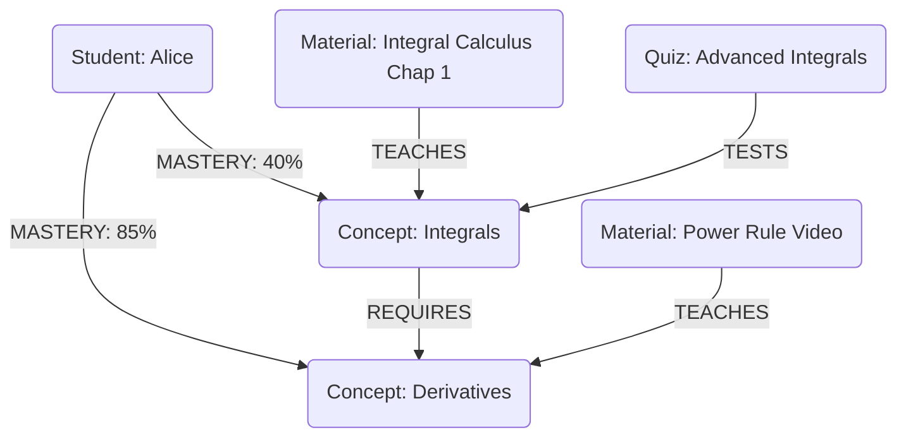

# Scholarly AI - Knowledge Graph (Phase 6)

## 1. Introduction
The Knowledge Graph dynamically maps out a student's curriculum, linking concepts, prerequisites, learning materials, and the student's mastery levels. It forms the core of the personalized AI Coach.

## 2. Graph Ontology
The graph consists of Nodes (Entities) and Edges (Relationships).

### 2.1 Nodes
- **Concept**: A distinct piece of knowledge (e.g., "Calculus", "Derivatives").
- **Material**: A learning resource (e.g., "Video Lecture 4", "Textbook Chapter 2").
- **Assessment**: A quiz or test evaluating a concept.
- **Student**: The learner.

### 2.2 Edges
- `REQUIRES`: Concept A requires Concept B.
- `TEACHES`: Material X teaches Concept A.
- `TESTS`: Assessment Y tests Concept A.
- `MASTERY_LEVEL`: Student S has Mastery M of Concept A.

## 3. Visualization

## 4. Graph Operations

| Operation | Description | AI Coach Usage |
|-----------|-------------|----------------|
| **Prerequisite Traversal** | Find all concepts leading to a target node. | Generating "Catch-up" study plans. |
| **Knowledge Gap Analysis** | Identify nodes where `MASTERY_LEVEL` < Threshold. | Recommending targeted practice. |
| **Content Recommendation** | Find `Material` nodes linked to low-mastery `Concept` nodes. | Serving relevant study materials. |

## 5. Storage and Sync
While graph relationships are complex, they are projected into Firestore collections for rapid querying. We utilize a combination of Document References and nested maps in Firestore to simulate graph traversal efficiently without needing a dedicated Graph Database like Neo4j for standard reads.
