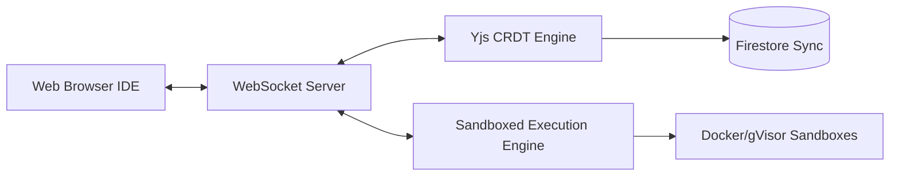

# Scholarly AI - Notebook Workspace (Phase 6)

## 1. Overview
The Notebook Workspace is an interactive, browser-based environment where students can write code, take rich-text notes, and execute scripts in a sandboxed environment. It integrates seamlessly with the AI Coach for real-time assistance.

## 2. Architecture

## 3. Collaboration via CRDTs
Real-time collaboration (multiplayer mode) is achieved using Conflict-free Replicated Data Types (CRDTs), specifically the `Yjs` library. This ensures zero merge conflicts when multiple students (or the AI Coach) are typing simultaneously.

## 4. Sandboxed Execution Engine
To safely execute user-provided code (Python, JavaScript, R):
- **Isolation**: Every notebook kernel runs in an ephemeral, isolated Docker container or gVisor sandbox.
- **Resource Limits**: Strict limits on CPU (0.5 vCPU), Memory (512MB), and Network (egress blocked unless explicitly whitelisted).
- **Timeout**: Execution forcibly terminated after 30 seconds to prevent infinite loops.

## 5. AI Integration
The AI Coach exists as a co-pilot within the workspace. It can:
- Read current cell content (via Global Context Engine).
- Suggest code completions.
- Explain stack traces and runtime errors automatically.
