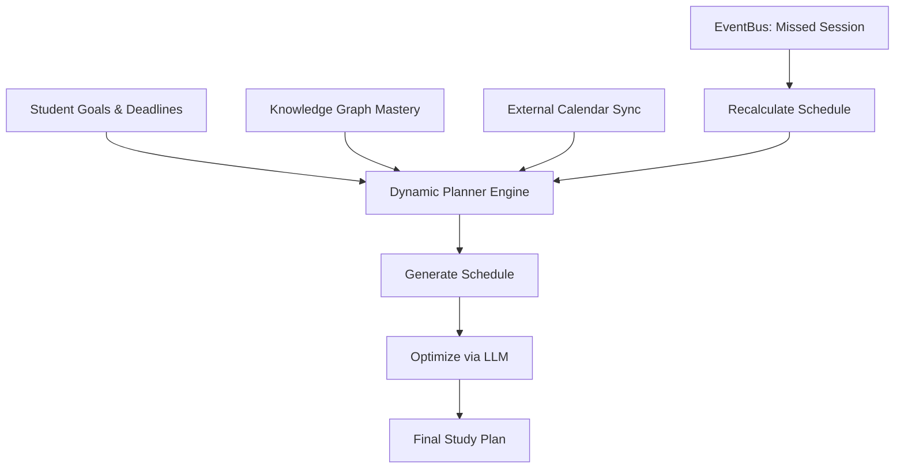

# Scholarly AI - Planner (Phase 6)

## 1. Introduction
The Planner engine dynamically generates, monitors, and adjusts study schedules. It operates autonomously via the Workflow Engine to ensure students meet their learning objectives prior to deadlines.

## 2. Planning Algorithm

The Planner uses a multi-objective optimization approach:
1. **Time Available**: Cross-references the student's available hours.
2. **Workload Estimation**: Uses historical data to estimate time-to-completion for modules.
3. **Spaced Repetition**: Schedules review sessions based on the Ebbinghaus forgetting curve.

## 3. Planner Architecture

## 4. Plan Adjustment (Self-Healing)
If the EventBus broadcasts that a student missed a scheduled session, or if a task took 50% longer than expected, the Planner triggers a "Self-Healing" workflow. It recalculates the schedule, distributing the missed workload evenly across remaining available slots without violating maximum daily study hours.

## 5. Schema Details

| Field | Requirement | Description |
|-------|-------------|-------------|
| `plan_id` | Required | Unique ID for the study plan. |
| `target_date` | Required | Deadline for the overarching goal. |
| `milestones` | Required | Array of sub-goals and dates. |
| `flex_buffer` | Optional | Percentage of time reserved for overflow/delays. |
