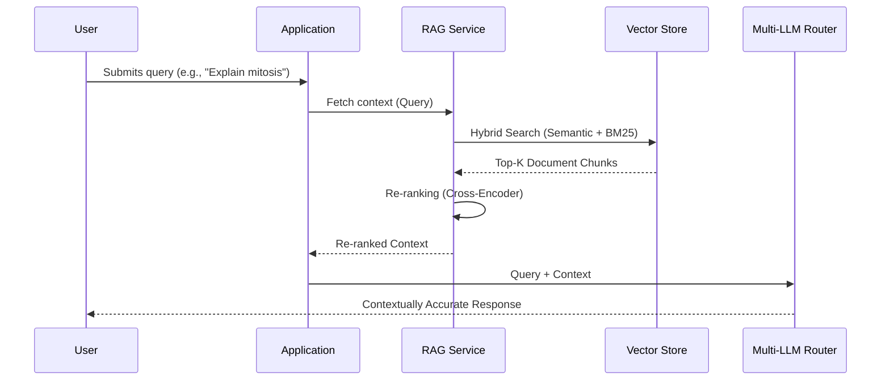

# Scholarly AI - RAG Pipeline (Phase 6)

## 1. Introduction
The Retrieval-Augmented Generation (RAG) Pipeline is fundamental to reducing hallucination and providing course-specific context to the AI models. In Phase 6, we utilize an advanced Hybrid Search architecture spanning semantic embeddings and keyword matching.

## 2. Architecture

## 3. Ingestion Strategy

### 3.1 Document Processing
- **Format Support**: PDF, DOCX, PPTX, TXT, HTML.
- **Chunking Strategy**: Semantic chunking based on header hierarchy and paragraph breaks, optimized for 512-1024 token windows.
- **Metadata Tagging**: Each chunk is tagged with Course ID, Module ID, Document Type, and Temporal metrics.

### 3.2 Embedding Pipeline
- **Model**: text-embedding-004 (Google) or text-embedding-3-large (OpenAI).
- **Dimension Reduction**: Optional PCA if vector DB storage constraints arise.

## 4. Search and Retrieval

| Search Type | Mechanism | Best For |
|-------------|-----------|----------|
| Dense/Semantic | Cosine Similarity on Embeddings | Conceptual questions ("How does X relate to Y?") |
| Sparse/Keyword | BM25 | Exact terminology, proper nouns, acronyms |
| Hybrid Search | Reciprocal Rank Fusion (RRF) | General purpose, maximum recall |
| Re-ranking | Cross-Encoder Model | Precision enhancement for the top 10-20 results |

## 5. Security and Access Control
Vector retrieval respects Firestore document-level permissions. A user query will *only* embed a metadata filter ensuring it searches vectors associated with their enrolled courses.
