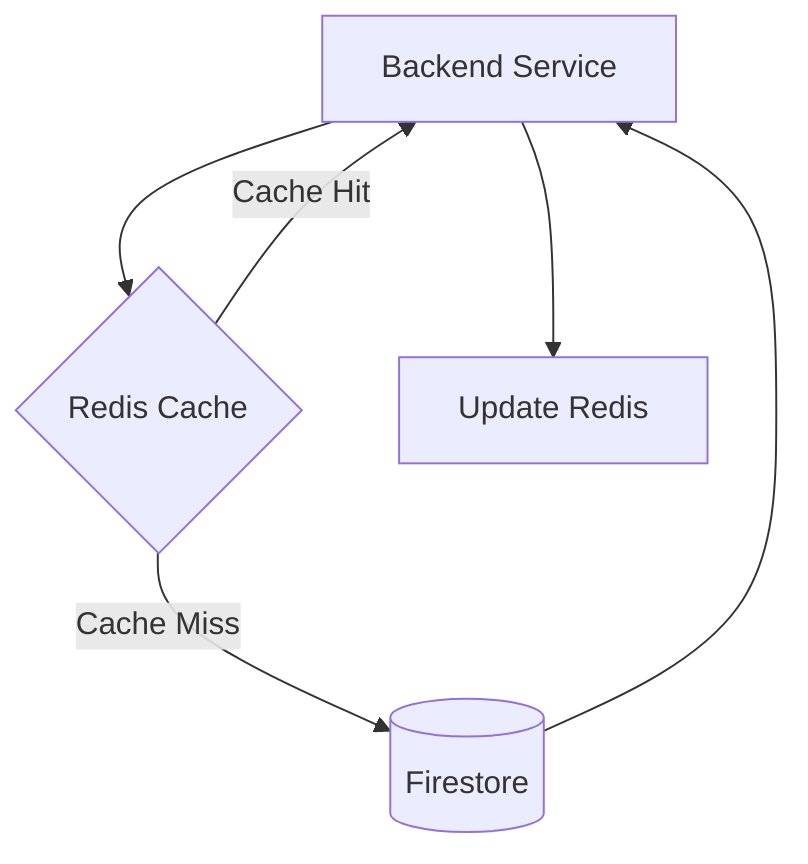

# Scholarly AI - Scalability (Phase 6)

## 1. Overview
To handle massive concurrent user bases, particularly during high-stress periods like exam weeks, the Phase 6 architecture employs aggressive caching, auto-scaling compute layers, and database sharding techniques.

## 2. Handling Firestore Limitations
Firestore has soft limits (e.g., 10,000 writes/second per database, 1 write/second per document).

### 2.1 Mitigation Strategies
- **Counter Sharding**: Highly active documents (like aggregate course views) use distributed counters to prevent document contention.
- **Write Batching**: High-frequency telemetry (like Notebook keystrokes) are buffered in memory and written in batches every 5 seconds.
- **Read Heavy Workloads**: Handled almost entirely by the Redis caching layer.

## 3. Caching Architecture (Redis)

### 3.1 Global Context Engine Caching
The Global Context Engine relies heavily on Redis for ultra-low latency reads (<2ms) to verify state (like Exam Mode) on every incoming API request without hitting Firestore.

## 4. Auto-Scaling Compute
- **Stateless APIs**: Managed by Google Cloud Run, scaling from 0 to 1000+ instances in seconds based on HTTP request volume.
- **Workflow Engine Workers**: Deployed on GKE with Horizontal Pod Autoscaling (HPA) based on EventBus queue depth (CPU/Memory metrics are secondary).

## 5. Performance Targets

| Metric | Target | Peak Load Target |
|--------|--------|------------------|
| API Gateway Latency | < 50ms | < 100ms |
| LLM First Token (Streaming) | < 1.5s | < 3s |
| EventBus Delivery Latency | < 10ms | < 50ms |
| Workflow State Transition | < 200ms| < 500ms|
