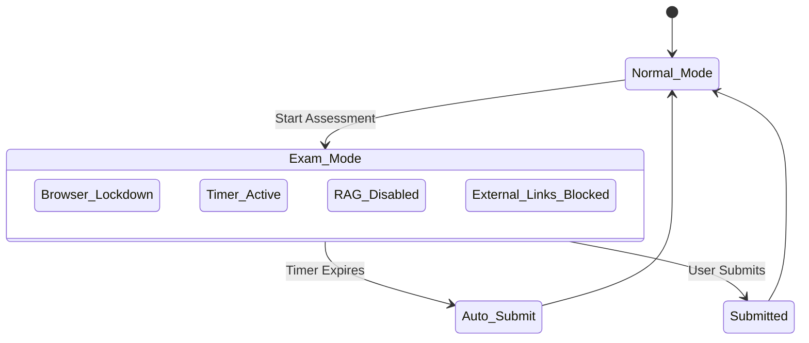

# Scholarly AI - Test Engine (Phase 6)

## 1. Overview
The Test Engine is responsible for real-time assessment generation, adaptive difficulty scaling, and instant evaluation. It operates closely with the Global Context Engine (Exam Mode) to ensure academic integrity.

## 2. Adaptive Testing Logic
Based on Item Response Theory (IRT), the Test Engine adjusts the difficulty of the next question based on the performance of the current question.

### 2.1 Difficulty Scaling
- **Correct Answer**: Next question difficulty increases by +1 level.
- **Incorrect Answer**: Next question difficulty decreases by -1 level.
- **Partial Credit**: Difficulty remains stable.

## 3. Exam Mode (Global Context Engine)

## 4. Grading Pipeline
The grading pipeline utilizes the Multi-Agent Workflow Engine.

| Agent Role | Function |
|------------|----------|
| **Syntax Checker** | Validates code/math syntax instantly. |
| **Semantic Grader** | Uses LLM to grade free-text responses against a rubric. |
| **Plagiarism Detector**| Cross-checks responses against vector DB and internet sources. |
| **Aggregator** | Synthesizes scores and provides final feedback. |
