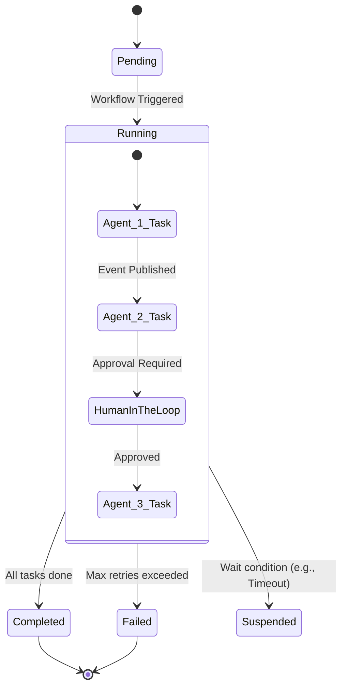

# Scholarly AI - Workflow Engine (Phase 6)

## 1. Overview
The Multi-Agent Workflow Engine is the backbone of autonomous task execution in Phase 6. It manages complex, stateful workflows that require coordination between multiple specialized AI agents, utilizing the EventBus for asynchronous message passing.

## 2. Workflow State Machine

Workflows are modeled as Directed Acyclic Graphs (DAGs) executed by a robust state machine.

## 3. Agent Coordination (EventBus)
Agents do not communicate directly. Instead, they publish and subscribe to topics on the central EventBus.

### 3.1 Standard Workflow: Essay Grading
1. **Event**: `assessment.submitted`
2. **Agent 1 (Rubric Analyzer)**: Subscribes to event, fetches rubric, publishes `rubric.analyzed`.
3. **Agent 2 (Fact Checker)**: Subscribes to `rubric.analyzed`, runs RAG checks, publishes `facts.verified`.
4. **Agent 3 (Final Grader)**: Synthesizes previous agent outputs, generates final grade, publishes `assessment.graded`.

## 4. Persistence and Recovery
Workflow states are persisted in Firestore. 
- **Idempotency**: All agent tasks are designed to be idempotent.
- **Checkpointing**: State is saved after every successful agent transition.
- **Recovery**: If a pod crashes, the Workflow Engine resumes the DAG from the last successful checkpoint.

## 5. Workflow Definitions (Schema)

| Field | Type | Description |
|-------|------|-------------|
| `workflow_id` | String | Unique UUID for the workflow execution. |
| `type` | Enum | E.g., `ESSAY_GRADING`, `STUDY_PLAN_GEN`. |
| `state` | Enum | `PENDING`, `RUNNING`, `COMPLETED`, `FAILED`. |
| `context` | JSON | Shared memory space for agents in this workflow. |
| `history` | Array | Audit log of all state transitions and events. |
